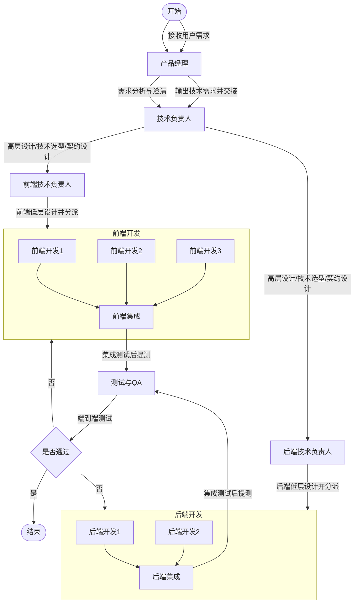

# 团队协作流程：研发工作流（异步可追溯版）

目标：你不需要看到具体交流过程，但团队协作必须“可追溯、可验收、可回滚”。因此所有沟通都通过文档/契约/代码/测试/Runbook 落盘。

## 1. 总览流程

## 2. 每个阶段的“输入/输出”（团队只对产物负责）

### 2.1 PM：接收需求 → 输出可验收需求

- 输入：用户需求/痛点/场景
- 输出（落地到仓库）：
  - `docs/feature-brief.md`：范围、非目标、验收标准、演示脚本（30-60s）
  - （可选）`docs/pricing.md`：售卖/交付物/定价假设

### 2.2 Chief TL：高层设计/契约设计

- 输入：`docs/feature-brief.md`
- 输出：
  - `docs/system-architecture.md`：边界、组件、关键决策
  - `packages/contracts/openapi.yaml`：对外契约（若有后端）
  - `docs/runbook-*.md`：一键启动/一键测试/故障排查

### 2.3 FE TL / BE TL：低层设计（LLD）

- 输入：架构与契约
- 输出：
  - `docs/<frontend-app>-design.md`：页面/状态/数据流/测试计划
  - `docs/<backend-app>-design.md`：接口/领域模型/持久化/测试计划

### 2.4 FE Dev / BE Dev：实现与单测

- 输入：已批准的 LLD + 契约
- 输出：
  - 生产代码 + Tier 0-2 测试
  - Runbook 更新（可复制命令）

### 2.5 QA：端到端验证

- 输入：可运行系统 + runbook + 契约
- 输出：
  - E2E/回归测试结果（必要时写到 `docs/testing/`）
  - 缺陷报告（可复现步骤 + 期望/实际）

## 3. 门禁（Definition of Done）

- 有 `feature-brief` 且验收标准清晰
- 有契约（有后端时）且 FE/BE 对齐
- 本地一键运行与一键测试写进 runbook
- 关键用户路径覆盖：成功/加载/空/错误状态
- 测试全绿（unit/integration；有 E2E 时按要求通过）

## 4. 你不看过程也能控进度的方式

你只需要看 3 个地方：

- `docs/feature-brief.md`：目标有没有变、验收是否明确
- PR 列表：每个 PR 的标题是否对应某条验收标准
- runbook：命令是否能一键跑通

## 5. 与“暂停协议”的关系

当你发起“进入交付/暂停学习”指令，团队按 `docs/团队机制-持续学习与暂停协议.md` 在 15 分钟内收口学习产物，并切换到交付工作流。

